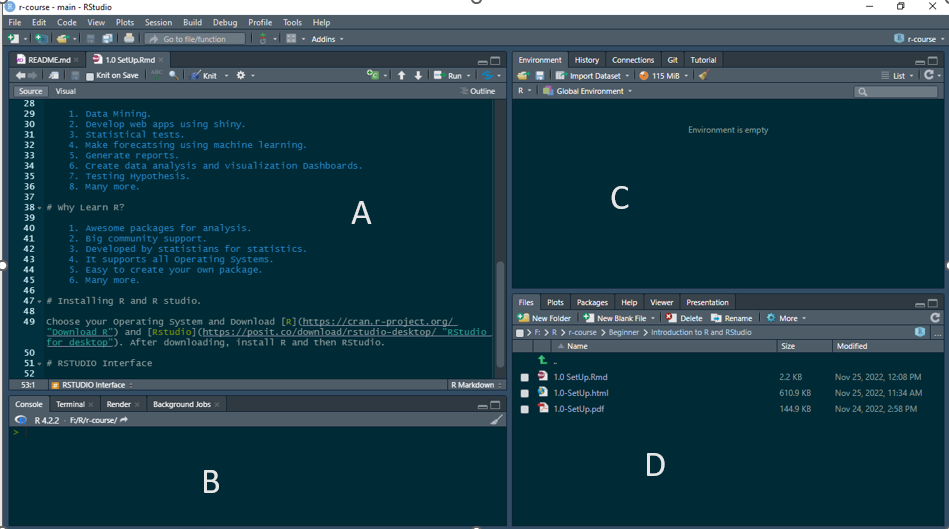

```{r setup, include=FALSE}
library(learnr)
library(gradethis)

gradethis::gradethis_setup()
knitr::opts_chunk$set(echo = TRUE)
```

## Introduction To R

R is statistical programming language designed by **Ross Ihaka** and **Robert Gentleman** and developed by the **R Core Team**. R is open source and is mainly used by analysts in many fields including, but not limited to *Data mining*, *statistics*, *bio-statistics*, *machine learning*, and *time series analysis*.

In recent years, R has been gaining popularity due to its ease of analyzing and documenting results. It has a Comprehensive R Archive Network (CRAN), responsible for hosting thousands of packages that help extend its functionality.

## Introduction To RSTUDIO

**RSTUDIO** is an Integrated Development Environment (IDE) designed and developed for the purpose of writing, debugging, and testing code in R. It comes with many features like generating reports, and visualizing data that will help you a lot as you use R. It was developed in *C++*, *Java* and *JavaScript* and supports all operating systems.

**RSTUDIO** comes in two versions, RSTUDIO Desktop, which we will use for this course and the RSTUDIO server, can be accessed in the web browser.

## What can I do with R?

    1. Data Mining.
    2. Develop web apps using shiny.
    3. Statistical tests.
    4. Make forecatsing using machine learning.
    5. Generate reports.
    6. Create data analysis and visualization Dashboards.
    7. Testing Hypothesis.
    8. Many more.

## Why Learn R?

    1. Awesome packages for analysis.
    2. Big community support.
    3. Developed by statistians for statistics.
    4. It supports all Operating Systems.
    5. Easy to create your own package.
    6. Many more.

## Installing R and R studio.

Choose your Operating System and Download [R](https://cran.r-project.org/ "Download R") and [Rstudio](https://posit.co/download/rstudio-desktop/ "RStudio for desktop"). After downloading, install R and then RStudio.

## RSTUDIO Interface

The RSTUDIO interface consists of one screen split into 4 sub-screens: -

    A. scripts screen: This is where you will right your scripts and 
        markdown files.
    B. Console & Terminal screen: All code output will be displayed here.
    C. Environment Screen: the variables loaded in the current working 
       environment will be diplayed here.
    D. Files, Plots, Packages, Help screen: All files in the current working
       directory, plots and packages will be in this screen.
       

